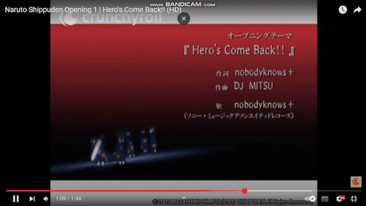

# Akatsuki 3D Rotation Slider

This is a slider of the **Akatsuki members** from the well-known japanese Manga series _Naruto Shippuden_, that animates as a 3D rotation around the _Gedo Mazo statue_.  
You can also play a **background music** amongst a set of 5 musics (OSTs and Opening) that I included there to make the experience a bit immersive.  
Also, notice that the color of circle background behind each member matches their own respective ring color.  
If you are a Naruto fan like me, enjoy the experience. ✨

## Screenshot

## Live webpage

You can view it [here](https://amazingtool777.github.io/Akatsuki-3D-rotation-slider/)

## Inspiration

On the New Year's Eve of 2025, I got bored and decided to come up with a lightweight frontend project that would teach a few new skills about HTML, CSS and Javascript.  
 
Thereafter, I browsed some frontend projects on Youtube and I came across [this video](https://www.youtube.com/watch?v=yqaLSlPOUxM&t=16s&pp=ygUObHVuIGRldiBzbGlkZXI%3D) of [Lun Dev](https://www.youtube.com/@lundeveloper) that teaches how to build a Crazy 3D Image Slider Effects using CSS only which went pretty viral:
  
 
That one appealed to me as a project so I attempted to recreate the same animation while applying a special touch of mine. I have recently binge-watched the Naruto Shippuden series and remembered this badass scene in the first opening of the series where the Akatsuki members were advertised for the first time. I still remember the hype that everyone had for that scene 😆:
  
 
Inpired from that Akatsuki introduction scene in the opening, my own concept was having each akatsuki member inside the slider cards rotating around the Gedo Mazo statue.  
At first, I decided to also include the first opening as the background music with a view to recreate the scene in the most similar way as possible. However, I told myself why not let the user choose the background music amongst a set few backgroud musics so that led to the final result:

## Acknowledgements

- With respect to [the origial 3D slider](https://www.youtube.com/watch?v=yqaLSlPOUxM&t=16s&pp=ygUObHVuIGRldiBzbGlkZXI%3D), I did not recreate a full tutorial. Instead, I watched the video just a few times while noting the key tricks and CSS features that I had not known before and attempted to problem solve their uses on my own.
- The project was intended to be finished on the same New Year's Eve and be presented as the 2025 new year's welcome project but oh snap 😆, I ended up writing waaay more code that initially expected.
- Nevertheless, I have learned a lot of useful new things through that simple project such as _3D transformations in CSS_, setting _perspectives_, _transformations along the z-axis_, the _transform-origin_ CSS proprety, the _interpolate-size_ CSS property to enable transitions from|to intrinsic values, sequential javascript animations of elements using _promises_ and _event listeners_, and manipulation of _Audio_ objects in javascript.
- In terms of code cleanliness, readability and performance, it is a little bit messy right now 😆 but I do not plan to refactor it anyways so good luck trying to make sense of the codebase 😜👌.
